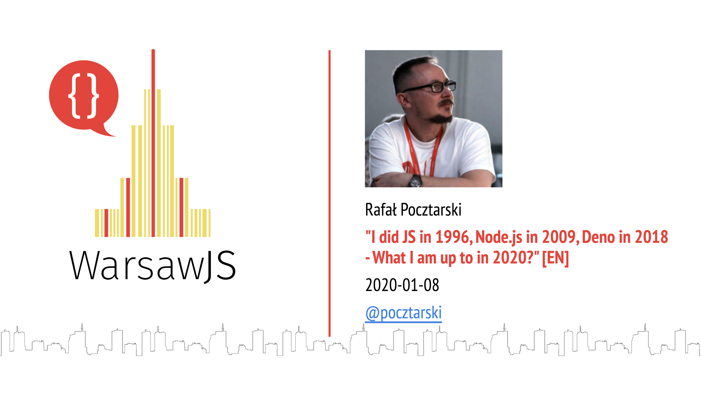

---

I did JS in 1996, Node.js in 2009, Deno in 2018

# What I am up to in 2020?

RAFAŁ POCZTARSKI &nbsp;&nbsp;&nbsp;&nbsp;&nbsp;&nbsp; @POCZTARSKI
---

# Rafał Pocztarski

You may know me from Stack Overflow

# pocztarski.com

<small>(and also from Medium, Quora, etc.)</small>

---

# WASI?

---

"If X + WASI existed in 2008, we wouldn't have needed to created Docker. That's how important it is. X on the server is the future of computing. A standardized system interface was the missing link. Let's hope WASI is up to the task!"

Solomon Hykes, founder and CTO of Docker March, 2019

---

"If WASM + WASI existed in 2008, we wouldn't have needed to created Docker. That's how important it is. Webassembly on the server is the future of computing. A standardized system interface was the missing link. Let's hope WASI is up to the task!"

Solomon Hykes, founder and CTO of Docker March, 2019 [on Twitter](https://twitter.com/solomonstre/status/1111004913222324225)

---

WAT?

---

WASM?

---

# `[1, 1, 1].map(parseInt)`

---

# Questions?

Slides: https://pocztarski.com/y20

## Rafał Pocztarski

## [pocztarski.com](https://pocztarski.com)

`[1, 1, 1, 1].map(parseInt)`
